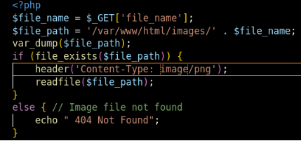
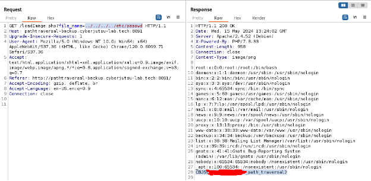
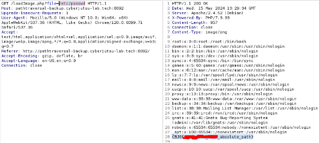

**Path Traversal by Cyber Jutsu**

**CopyRight : TimoMangCut**

**I/ Review Code & Exploit**

**1/ Level 1**

Giao diện website sẽ là những hình ảnh trông giống như một cửa hàng	và chúng ta có thể click view để xem từng sản phẩm. 

Reivew code : Ở đây chúng ta có thể thấy Untrust Data xuất phát từ biến $\_GET(file\_name)

Nếu như tồn tại `file\_path` thì sẽ sử dụng method readfile để đọc file đó ra. 

- Untrust Data đã gặp Unsafe Method

Exploit : Goal của bài này là đọc /etc/passwd

Đối với mục dạng bài Path traversal, Ta có thể sử dụng 

- .. : Đại diện cho thư mục trước đó
- . : Đại diện cho thư mục hiện tại

Tôi sẽ thử sử dụng `..` để quay về thư mục gốc sau đó đọc /etc/passwd

**2/ Level 2**

Đối với level 2 thì Goal và giao diện vẫn như vậy

Chỉ có điều code đã thay đổi : 

Review Code : Ở đây chúng ta không thể sử dụng `..` để bypass được nữa. Nếu dùng sẽ bị chửi.

Còn 1 điều nữa, đó chính là không như level 1, anh developer đã không khoanh vùng như `/var/www/html/images`. Mà ảnh chỉ hỏi là nếu file path tồn tại thì sẽ đọc. Vậy có nghĩa là đọc được tất cả các file nào miễn sao path đúng thôi là được. 

Exploit : Bài này thì ta có thể đọc được tất cả file nếu như đúng file\_path

**3/ Level 5**

Review Code : Ta thấy có Untrust Data là $game, không được giới hạn trong server mà nó rơi thẳng vào hàm include rất nguy hiểm. Nhưng nếu như không cho upload hay tác động bất cứ thứ gì vào server thì làm sao để RCE nhỉ ?

Liệu rằng có file gì đó mà mình có thể chèn code vào và nó chạy theo hàm include ko? Có cách nào mà ta có thể làm cho untrust data rơi vào một file có sẵn trên server không?

Research Time Start and End after 5minutes

Tính năng mặc định của Apache Server là tự động lưu log của users vào /var/log/apache2 với các file log như access.log và error.log dựa trên file config của challenges

Có nhiều trường trong gói tin HTTP ta có thể thay đổi và chèn code PHP vào đó như : Referer, User-Agent, Request String hay Request String in Body,…

Ta sẽ sử dụng User-Agent để chèn code PHP vào xem sao. Lần này tôi sẽ bỏ qua bước test, và vào luôn 1 con shell.

Vì sao tôi lại không test phpinfo() trước khi viết một con shell ngon vứt vào, vì nó sẽ display full cái màn hình và khó khăn hơn cho việc tìm kiếm, nói chung là `bạn không hiểu, tôi hiểu là được.`

3

` `Note : 3 level sau của Path traversal tôi để trong bài file upload
